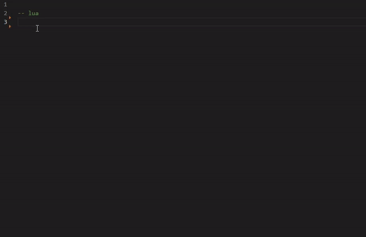

# mani
Mani is an odin-to-lua exporter that generates Lua C API bindings and LSP code completion for your odin source files. 

```odin 
package main

import "core:fmt"
import "shared:lua"
import "shared:luaL"
import "shared:mani"

@(LuaExport = {
    Name = "my_nice_fn",
})
test :: proc(var: int) -> (result1: int, result2: int) {
    fmt.printf("Lua: Var is %d\n", var)
    result1 = 60 + var
    result2 = 40 + var
    return
}

main :: proc() {
    L := luaL.newstate()
    mani.export_all(L, mani.global_state)
}
```
```lua
-- lua code
res1, res2 = my_nice_fn(3)
print("Results from Call: " .. res1 .. " " .. res2)
```

## Overview

### Procedures
```odin
@(LuaExport = {
    Name = "print_object", // optional
})
half_object_print :: proc(using v: HalfObject) {
    fmt.printf("My value is %d, and my hidden is %d\n", value, hidden)
}
```
- Procedures support all primitive types (string, cstring, ints, floats) as results and parameters
- Pointers are only supported with exported structs/arrays
- Multiple return values are supported

### Structs 
- Code completion is automatically configured to work for the new struct type declared
- You must specify the userdata `Type` in `LuaExport` to either be `Full`, `Light` or both of them
- Mani converts automatically between light and full userdata, depending on the context. If the user needs a value, it will be a value.
- The term light userdata in mani's context is not fully accurate. Light userdatas cannot have metatables. What mani does is create a full userdata which is a wrapper around a single pointer. This allows to modify odin from within lua, while still allowing a metatable. 
- Passing a struct by value or pointer in odin doesn't have any correlation with the `Type` supported. It will *just work*
```odin 
@(LuaExport = {
    Name = "half_object", // optional lua name
    Type = { // Light or Full userdata. You must have at least one of these
        Full, // The struct can be allocated in lua fully
        Light // A wrapper to a pointer, usually from odin. You can modify odin from lua with this
    },

    // Optional field access
    Fields = {
        value = "val",
    },

    // Methods/metamethods assume that the first parameter of the proc is the object itself. 
    // The object can either be passed by value or by pointer
    // All methods/metamethods require to be @LuaExport'ed
    Methods = {
        half_object_print = "print",
        mod_object = "mod",
    },
    Metamethods = {
        __tostring = half_object_tostring,
    },
})
HalfObject :: struct {
    value: int, 
    hidden: int, // Not in fields, therefore private
}


@(LuaExport)
make_object :: proc(v: int) -> (result: HalfObject) {
    return {
        value = v,
        hidden = v + 1,
    }
}

@(LuaExport)
mod_object :: proc(o: ^HalfObject, v: int) {
    o.value = v
}

@(LuaExport)
half_object_tostring :: proc(using v: HalfObject) -> string {
    // Lua will allocate a string when you push it, so this can be on the temp allocator
    return fmt.tprintf("HalfObject {{%d, %d}}", value, hidden)
}
```


### Arrays
- Mani supports arrays up to 4 elements
- Swizzling support in lua!!!
- Methods/metamethods support
- Because you can convert make conversions between different sizes of arrays via swizzling, mani requires to specify the conversions via `SwizzleTypes`, while also exporting every type defined in there. This is a bit of a headache, and I'm hoping to find a better solution to this
- Distinct types not yet supported, because distinct and swizzling works rather weird in odin aswell
```odin
@(LuaExport = {
    Name = "vec2f64",
    Type = {Light, Full},
    SwizzleTypes = {Vec3, Vec4}, // For type conversions when swizzling (local my_vec3 = v.xyy) 
    Fields = xyrg, // Needs to be divizible by len(array). It will treat x, r as arr[0] and y,g as arr[1]
    Metamethods = {
        __tostring = vec2_tostring,
    },
})
Vec2 :: [2]int 

// We will need to declare all our swizzles

@(LuaExport = {
    Name = "vec3f64",
    Type = {Light, Full},
    SwizzleTypes = {Vec2, Vec4}, // A Vec3 can construct a Vec2 and a Vec4
    Fields = xyzrgb,
    Metamethods = {
        __tostring = vec3_tostring,
    },
})
Vec3 :: [3]int


@(LuaExport = {
    Name = "vec4f64",
    Type = {Light, Full},
    SwizzleTypes = {Vec2, Vec3},
    Fields = xyzwrgba,
    Methods = {
        vec4_tostring = "stringify",
    },
    Metamethods = {
        __tostring = vec4_tostring,
    },
})
Vec4 :: [4]int  


@(LuaExport)
make_vec4 :: proc(x: int, y: int, z: int, w: int) -> Vec4 {
    return {x, y, z, w}
}

@(LuaExport)
vec4_tostring :: proc(v: Vec4) -> string {
    return fmt.tprintf("{{%d, %d, %d, %d}}", v.x, v.y, v.z, v.w)
}

// ... and so on
```
```lua
-- lua code
local v = make_vec3(2, 3, 4)
local v2 = v.xz -- v2 is of type Vec2 
v2.xy = v.zz 
```

### LSP Code Completion


## Getting Started
- Download [odin-lua](https://github.com/DragosPopse/odin-lua)
- For lua code completion, download [lua-language-server](https://github.com/sumneko/lua-language-server)
- Place the contents of the shared directory in `%ODIN_ROOT%/shared` folder or a collection of your choice. If `ODIN_ROOT` is configured, you can just call `copy_to_shared.bat`
- Build `generator` directory `odin build generator -out:build/mani.exe`
- Create a `.json` file with the configuration of the generator. See [the example config](mani_config.json) for all the available options
- The output executable accepts a json as parameter `mani config.json`. You can specify `--show-timings` for benchmarking the performance of the generation. 
- The output of `mani` is a source file `*.(config.odin_ext)` and a LSP file `*(config.lua_ext)` for each package encountered in the directory and it's subdirectories.
- When initializing the lua state, call `mani.export_all` in order to hook all the code generated to your lua state
```odin
import lua "shared:lua"
import luaL "shared:luaL"
import mani "shared:mani"
main :: proc() {
    L := luaL.newstate()
    mani.export_all(L, mani.global_state)
}
```
- Build your source with the `-ignore-unkown-attributes` flag

## Configuration
- See [the example config](mani_config.json) for all the available options
- `dir` refers to the odin source folder you want to generate for. `meta_dir` refers to the lua directory you want to put the LSP generation.
- In order to prevent mani for looking to generate code for the already generated files, provide a longer extension for the `odin_ext` and `lua_ext`. For example: `.generated.odin`/`.lsp.lua`
- `types` accepts a dictionary of arrays. Each key will represent a lua type, while the array value will be a list of odin types to be converted to lua. This is used by the code completion generation. The types exported by your application will already be correctly configured, so you only need to worry about primitives. Because the parser doesn't do any package resolution, `c.int` and `int` both need to be there and will be treated as distinct types. Aliasing any one of them in your code means that you need to add the alias in your configuration aswell.


